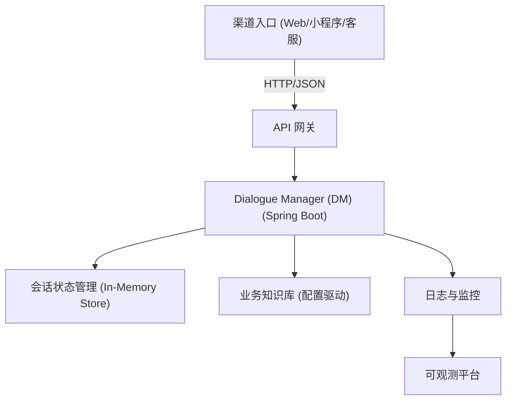
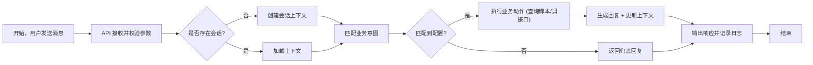
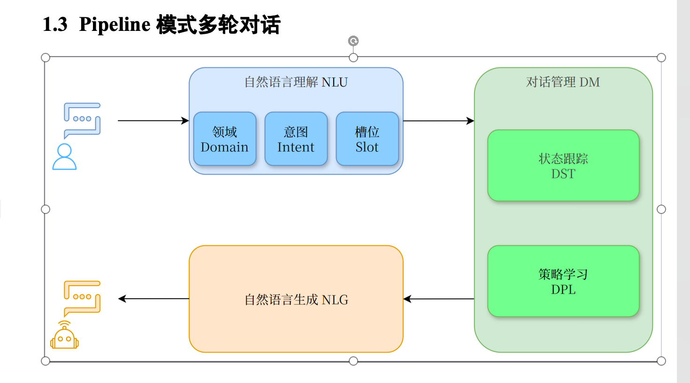

# 企业对话系统 Demo 设计文档

## 1. 目标

- 搭建一个简单的企业级对话系统 Demo，帮助学习业务流程与基础架构。
- 使用 Java + Spring Boot 技术栈，实现可运行的 REST 接口。
- 重点演示业务模块协作与流程，不追求复杂的对话算法。

## 2. 系统架构



**说明**
- 渠道入口发送请求至 API 网关，可直接用 Nginx 或轻量级网关模拟。
- Dialogue Manager (DM) 是本项目核心：负责对话流控制、策略选择、回复生成。
- 状态管理示例使用内存 Map，真实场景可替换为 Redis。
- 业务知识库使用配置脚本 (YAML/JSON) 维护简单的对话节点。
- 日志与监控在 Demo 中以 Console 日志、简单指标暴露的形式呈现。

## 3. 业务流程



**流程说明**
1. 渠道层将用户消息通过 POST 请求发送到 `/api/dialogue/message`。
2. Controller 层完成参数校验与会话 ID 识别。
3. Service 层根据会话状态决定是否初始化上下文。
4. 意图匹配由配置脚本决定，Demo 中通过关键字匹配。
5. 匹配成功后触发预设的业务动作（例如查询 FAQ、返回订单状态）。
6. 生成回复、更新上下文并记录日志；若匹配失败则返回兜底回复。

## 4. 模块划分

| 层级 | 包 / 核心类 | 功能 |
| ---- | ---- | ---- |
| 渠道网关层 | `gateway.api.DialogueController` | 对外 REST API，负责入参校验、统一输出格式，代表业务网关/渠道适配层。 |
| 自然语言理解（NLU） | `nlu.config.IntentConfigLoader`<br>`nlu.IntentMatcher` | 加载 Rasa 风格 `nlu.yml`，解析领域 Domain、意图 Intent、槽位 Slot（关键词/正则/必填提示）。 |
| 对话管理（DM） | `dm.DialogueManager`<br>`dm.state.DialogueStateTracker`<br>`dm.policy.DialoguePolicy` | 管道核心。StateTracker 负责状态跟踪（DST），Policy 负责策略学习（DPL）并判断是否需要补槽。 |
| 自然语言生成（NLG） | `nlg.TemplateNlgService` | 将策略输出渲染到模板，可升级为复杂的 NLG 引擎。 |
| 会话上下文 | `context.ConversationContextStore` | 管理 Session 上下文、领域与槽位，当前为内存实现，可替换 Redis 等外部存储。 |
| 技能适配 | `skill.*` | 以适配器形式封装业务技能，demo 中包含 12306 订票示例。 |
| 知识与协议 | `model.*` | 数据契约层：`IntentDefinition`、`SlotDefinition`、`DialogueRequest/Response`、`ActionType` 等。 |

模块通过 Spring 依赖注入松耦合：网关层只依赖 DM，DM 再组合 NLU、DST、DPL、NLG 与上下文存储，形成 “NLU (Domain/Intent/Slot) → DM (DST + DPL) → NLG” 流水线，可覆盖多轮补槽。

### 4.1 Pipeline 模式



1. **NLU**：IntentMatcher 先按示例语句匹配意图，再依据 `SlotDefinition` 同时解析领域 Domain 与槽位 Slot（支持关键词与正则）。  
2. **DST（状态跟踪）**：`DialogueStateTracker` 负责将识别出的 domain/intent/slot 写入 `ConversationContext`，并维护 turn 编号、更新时间等，保证多轮对话状态持久。  
3. **DPL（策略决策）**：`DialoguePolicy` 根据当前上下文判定有哪些槽位尚未填充，缺失时生成补槽指令，否则进入业务动作。  
4. **NLG**：`TemplateNlgService` 根据 `PolicyDecision` 选择合适模板（FAQ、订单查询、人工转接），若策略要求补槽则返回对应 prompt。  
5. **多轮循环**：若用户补充槽位信息，DST 会实时更新上下文并重新触发 DPL，直至满足所有必填槽。最终 NLG 输出回复并由网关返回。

### 4.2 领域与槽位

- **Domain**：通过 `metadata.domain` 标记业务域，例如 `faq`、`order`、`service`，方便 DM/监控按领域路由。  
- **Slot**：每个意图可声明多个槽位，属性包含 `keywords`、`pattern`（正则）、`required` 以及 `prompt`。当 `required=true` 且缺失时，策略层会以 prompt 引导用户补齐。  
- **多轮示例**：
  1. 用户：“想了解订单进度” → 匹配 `order_status`，Policy 发现 `orderId` 缺失，NLG 返回 `请提供您的订单号，我来帮您查询。`
  2. 用户：“订单号 A001” → 正则命中，DST 填写 `orderId=A001`，Policy 判断无缺失槽，NLG 根据模板生成“订单 A001 已出库...”。

### 4.3 出行订票技能示例

1. **输入**：“我要去北京”。NLU 匹配意图 `book_train`（领域 `travel`），抽取 `destination=北京`。  
2. **DST**：记录 domain/intent/slot，回合数 +1。  
3. **DPL**：发现 `departureCity`、`departureDate` 仍缺失，于是按槽位顺序提示：“请告诉我出发城市…”。  
4. **用户补槽**：用户可以直接回复城市名称（如 “武汉”），系统根据 pending slot 将输入写入 `departureCity`，无需语法关键词；随后 DPL 再提示日期：“请告知出发日期…”。  
5. **再补槽**：“明天走” → NLU 正则命中 `departureDate=明天`，至此所有必填槽就绪，进入技能阶段。  
6. **技能调用**：`TemplateNlgService` 检测到 `actionType=SKILL`，委托 `skill.TrainTicketSkillAdapter` 模拟查询 12306，返回“正在为您打开 12306，查询 明天 从 武汉 前往 北京 的可选车次…”。  
7. **输出**：网关返回 domain、intentId、reply 以及上下文槽位（destination/departureCity/departureDate），前端可据此跳转真实订票页面。

## 5. 数据模型

```text
IntentDefinition
├─ id: String
├─ domain: String
├─ examples: List<String>   # 对应 Rasa nlu.yml 中的 examples
├─ replyTemplate: String
├─ actionType: ENUM (FAQ, ORDER_STATUS, HUMAN_HANDOFF, SKILL)
├─ skillName: String (当 actionType=SKILL 时指定适配器)
└─ slots: List<SlotDefinition>

SlotDefinition
├─ name: String
├─ keywords: List<String>
├─ pattern: String (Regex，可选)
├─ required: Boolean
└─ prompt: String
```

意图配置使用 Rasa `nlu.yml` 格式，包含 `version` 和 `nlu` 列表，例如：

```yaml
version: "3.1"
nlu:
  - intent: faq_shipping
    metadata:
      domain: faq
      actionType: FAQ
      replyTemplate: "我们的订单由顺丰配送，通常 1-3 天送达。"
      slots:
        - name: shippingTopic
          keywords:
            - 物流
            - 配送
          prompt: ""
    examples: |
      - 想了解物流
      - 发货了吗
  - intent: order_status
    metadata:
      domain: order
      actionType: ORDER_STATUS
      replyTemplate: "${orderStatus}"
      slots:
        - name: orderId
          required: true
          prompt: "请提供订单号"
          pattern: "(?i)(?:订单|单号)[:：\\s]*([A-Za-z0-9-]+)"
    examples: |
      - 查询订单
      - 订单号 A001
  - intent: book_train
    metadata:
      domain: travel
      actionType: SKILL
      skillName: train_ticket_12306
      slots:
        - name: destination
          required: true
          prompt: "请告诉我您要去的城市"
          pattern: "我要去([\\u4e00-\\u9fa5]+)"
    examples: |
      - 我要去北京
```

会话上下文示例：
```json
{
  "sessionId": "user-001",
  "domain": "faq",
  "lastIntent": "faq_shipping",
  "slots": {
    "orderId": "A001"
  }
}
```

## 6. 接口定义

### POST `/api/dialogue/message`
- **请求体**
```json
{
  "sessionId": "user-001",
  "message": "想了解一下物流"
}
```
- **响应体**
```json
{
  "sessionId": "user-001",
  "domain": "faq",
  "reply": "我们已安排顺丰配送，1-3 天送达。",
  "intentId": "faq_shipping",
  "context": { ... }
}
```

## 7. 日志与监控
- 使用 `Slf4j` 输出结构化日志，包含 sessionId、intentId、耗时等。
- 暴露 `/actuator/health` 供存活检查。

## 8. 部署建议
- Demo 可使用 `mvn spring-boot:run` 启动。
- 生产可打包成 Docker 镜像，运行在 K8s / 云容器平台。
